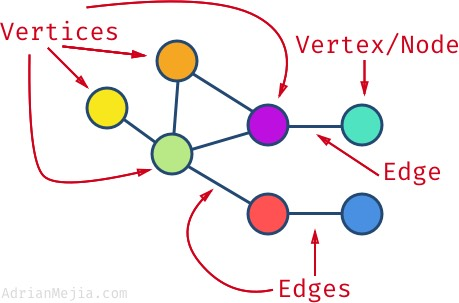

# Graph Basics

**Graphs** are a data structure comprised of connected **nodes** (also called **vertices**). The connections between vertices are referred to as **edges**. 



Graphs are useful for representing data with lots of interconnected relationships such as a network of friends on Facebook.

Graphs can be **directed** (relationships between nodes exist in one direction) or **undirected** (relationships in both directions). 


A **weighted** graph keeps track of the distances (or weights) between nodes. Here is an example of a graph visualization of connected airports, weighted by their distances:


### Adjacency List
**Adjacency List** is one way to represent the graph data structure. Each node has a list of all the nodes connected to it (its **adjacent** nodes).

Here is an example of a graph that stores vertices connections using an object.

```javascript
const graph = {
  a: ['b', 'd'],
  b: ['c'],
  c: ['a'],
  d: ['b', 'c']
}
```

```

## Questions
```
QUESTION 1. What type of graph should we use for our geolocation app? Directed? Undirected? Weighted or not? Explain.

QUESTION 2. Is the above graph directed or undirected? How do you know?

QUESTION 3. Draw an illustration of the graph above.
```