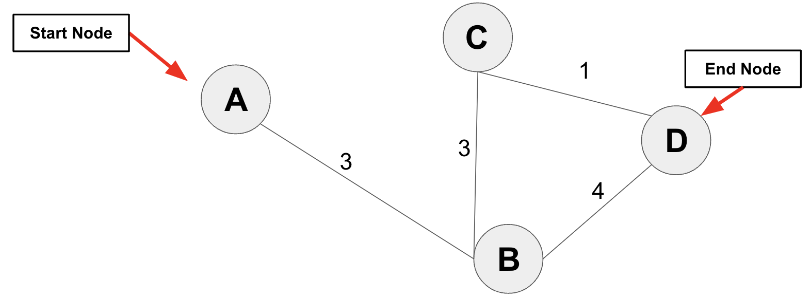
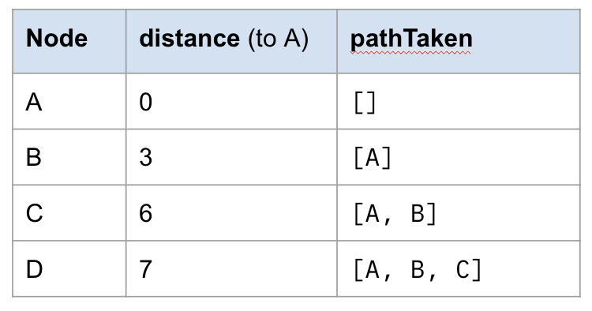

# Dijkstras Algorithm

## Overview
Watch [this video](https://www.youtube.com/watch?v=pVfj6mxhdMw) to understand the basics of Dijkstras Algorithm.

The only difference with the video and our code is that we will store the *entire path*, not merely the previous vertex, in order to make it easy to quickly determine the fastest route between any two points.

For example, if we start with the following graph, our Dijkstras algorithm will update the nodes in the graph so that their `distance` and `pathTaken` properties resemble the table below.

