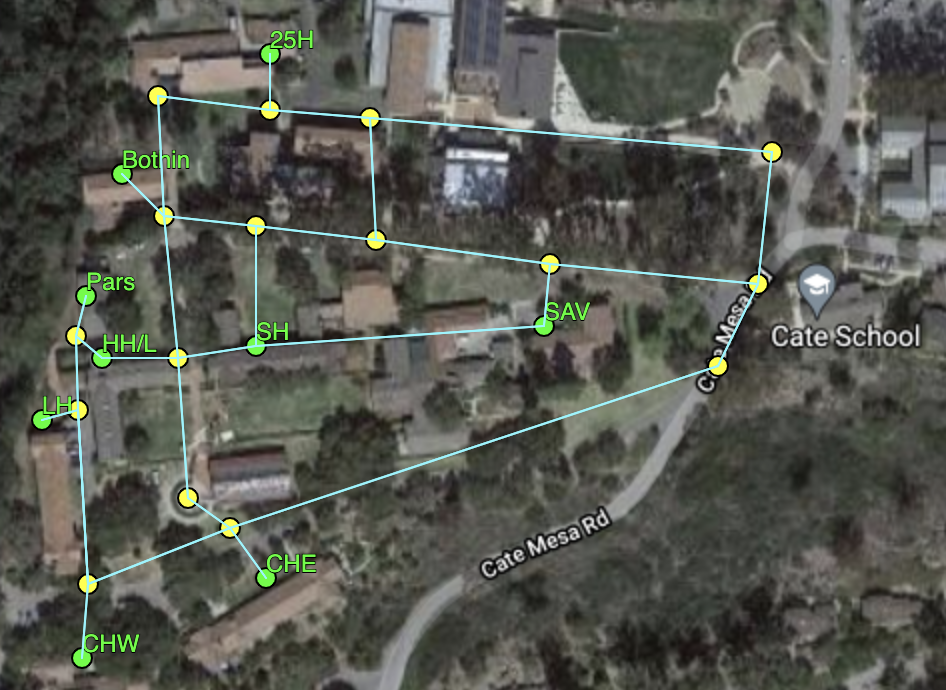

# Graph Lab

We are going to build a simple app to tell students the walking time and distance between various locations on campus. We will use a **graph** data structure to model the relationships between destinations (or "nodes"). This data structure will make it possible to perform necessary distance / time calculations.

[Here is a live demo](https://cateschool.github.io/Demo-Cate-Maps-Graph-App/) (developed by [Jonathan Yoo](https://github.com/JoYoo9442)) of the **Cate Maps App** that you are going to build. Try it out to see it in action.

## Instructions

#### I. Develop Context 
Read over the following notes and answer the associated questions in a separate document (paper, Google Doc, markdown, etc.). 

   1. [Graph Basics](Notes/1-GraphBasics.md)
   2. [Graph Classes](Notes/2-Classes.md) 
   3. [Dijkstra's Algorithm](Notes/3-Dijkstras.md)

#### II. Implement Dijkstra's Algorithm 
Follow the steps outlined [here](Notes/4-Implementation.md) to implement Dijkstra's algorithm and complete the Cate Map App.
#### III. Submit Work
When you are done, you can submit written questions via email to Ms. deBB. Submit your (working, complete) code by pushing your forked repo to GitHub.

